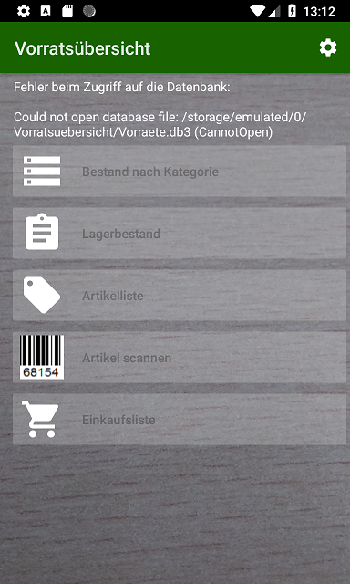
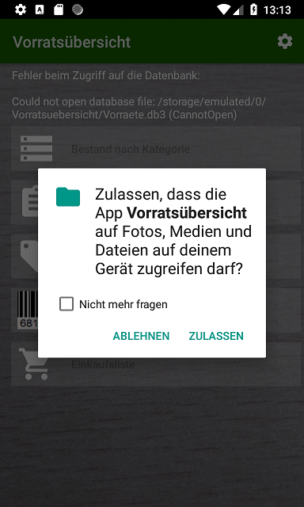

## Fehler beim Zugriff auf die Datenbank

### Ursache:

Wenn bereits eine Datenbank auf der SD Karte vorhanden
ist und z.B. durch Neuinstallation der Zugriff auf die SD Karte
nicht erteilt wurde, so wird die Datenbank zwar gefunden, der Zugriff daraus
jedoch vom Android verweigert.

### Lösung:

Erlauben Sie beim Starten der Anwendung den Zugriff auf die SD Karte.
Sollte die Frage nicht (mehr) kommen, weil "[X] nicht mehr fragen" ausgewählt wurde,
so kann die Anwendung deinstalliert und wieder neu installiert werden.

