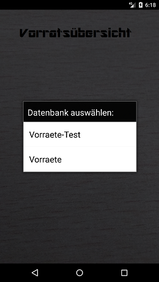

## Mehrere Datenbanken betreiben

Befinden sich im Verzeichnis der SD Karte mehrere Datenbanken,
so kommt beim Starten der App eine Auswahl der Datenbanken.

Alle Funktionen (Daten erfassen, Backup, Restore,...) beziehen sich dann auf diese Datenbank.
