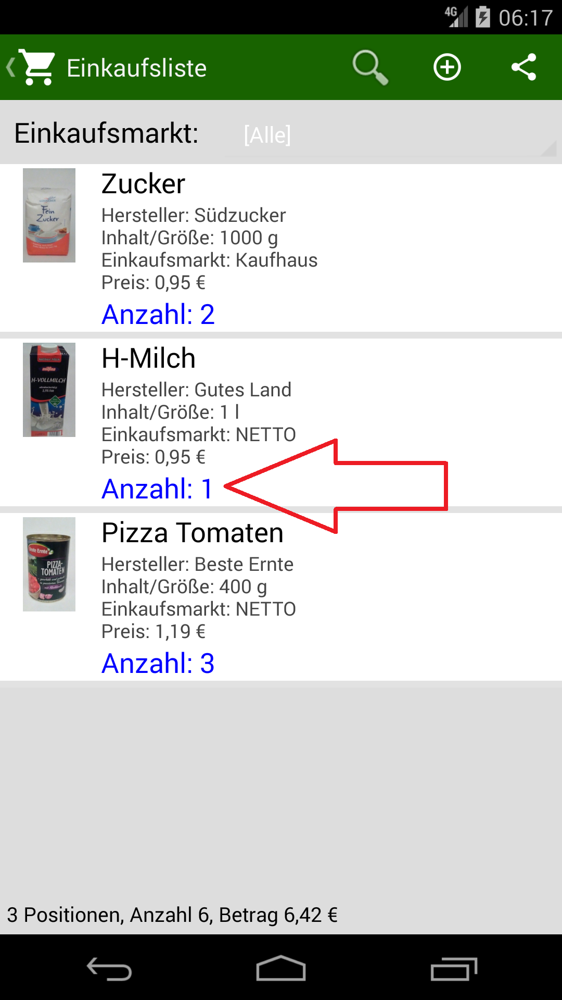
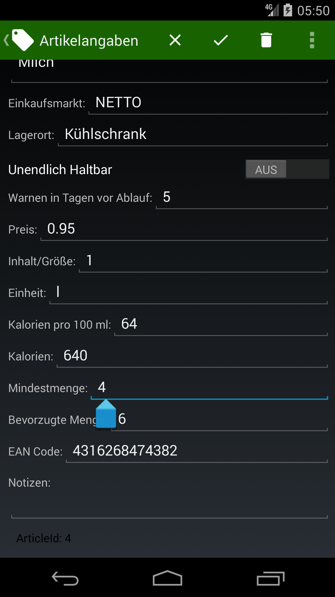
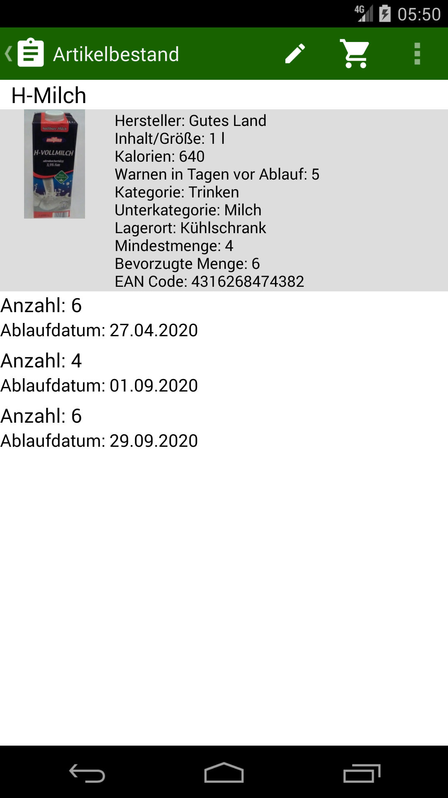
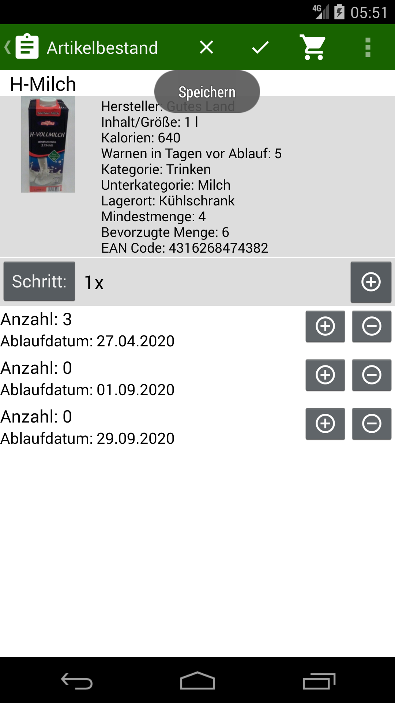
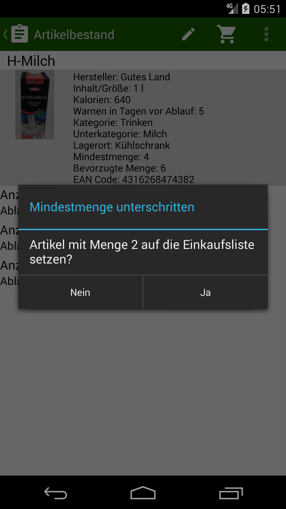

## Mindestmenge

Die H-Milch hat die Mindestmenge von 4
 

Im Lagerbestand sind aber 16 Stück
 

Wenn ich jetzt die Menge weniger als 4 Stück angebe…
 

… und Speichern klicke…
 

…dann kommt die Meldung…
(2 Stück, weil schon die Milch mit 1 Stück auf der Einkaufsliste steht).
 

…und der Artikel landet in der Einkaufsliste mit Anzahl 3 (weil bevorzugte Menge ist 6)
 
