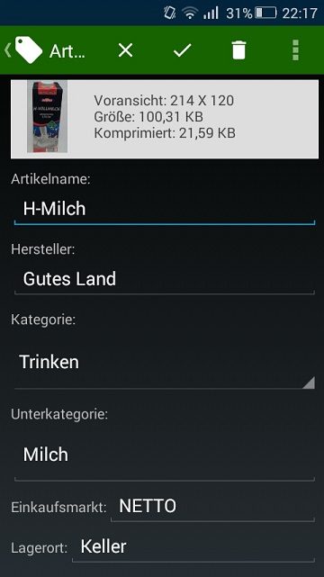
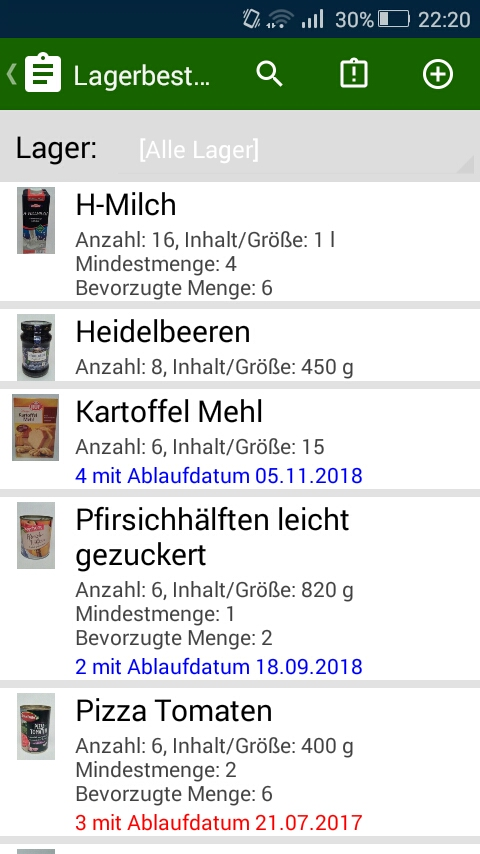
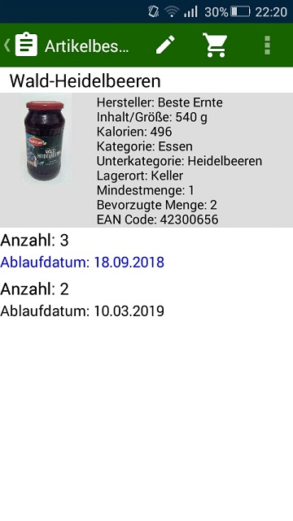


# Vorratsübersicht - Mindesthaltbarkeitsdatum von Vorräten überwachen

Mit dieser App können Sie Mindesthaltbarkeitsdatum der Lebensmittel in Ihren Vorräten überwachen.

## Funktionsweise:

Zuerst wird ein Artikel (einmalig) in "Artikelliste" mit seinen Angaben und ggf. Bild erfasst.

Danach kann man im "Lagerbestand" mit "+" den Artikel hinzufügen,

das Ablaufdatum ausgewählt und die Menge erfassen.

Nähert sich das Ablaufdatum oder wird das Datum überschritten, so erscheint eine Warnung in der App.
Für die Warnung vor dem Ablaufdatum kann pro Artikel Anzahl Tage definieren werden.

Wird beim Artikel der EAN Code eingetragen (oder gescannt),
so kann man über "Artikel scannen" direkt den Lagerbestand oder die Artikelangaben bearbeiten.
Die Artikeldaten werden über den EAN Code nicht automatisch (z.B. über's Internet) ermittelt.

## Testdatenbank:

Zum Testen oder Kennenlernen der App kann man auf eine Testdatenbank umschalten.
Diese enthält schon einige Artikel (ist keine Werbung für die Produkte).

## Projektentwicklung:

Die App ist mein privates Hobby-Projekt, was in meiner Freizeit entwickelt wird.
Die Benutzung erfolgt auf eigene Gefahr. Die App wird gewissenhaft entwickelt, 
dennoch kann ich für Schäden durch App oder Datenverlust keine Haftung übernehmen.
Für die Weiterentwicklung sind Programmierer oder Helfer (für Dokumentation,
Design oder als Betatester) herzlich willkommen.

## Fehler berichten:

Diese App wird ständig weiterentwickelt und kann noch Fehler enthalten.

Sollte Ihnen ein Fehler aufgefallen sein, bitte diesen genau beschreiben 
(wie kann er nachgestellt werden), möglichst Screenshots erstellen und an die 
unten aufgeführte E-Mail-Adresse versenden.

### Bekannte Probleme und Fehler:

1. Die Sortierung der Artikel berücksichtig nicht die deutschen Umlaute 
Die eingesetzte SQLite Datenbank unterstützt diese Sortierung nicht.

2. Eine Popup Benachrichtigung findet nicht statt. 
Um zu überprüfen, ob das Mindesthaltbarkeitsdatum
überschritten wurde, muss die App gestartet werden.

3. Die Datenbank befindet sich lokal auf dem Smartphone
und kann somit nicht von mehreren Benutzer verwendet werden.
